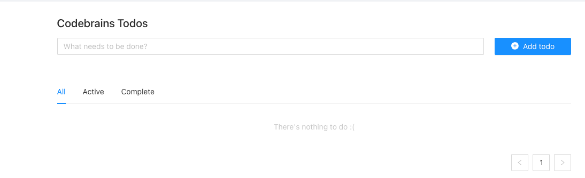

## Todo Web App
This project is the Frontend part of ToDo app based on Golang, React and Fiber, backend part you can find here https://github.com/monkrus/todo-app

### How to start:
before you start make sure your local DB up and running also do the following
- run backend: clone this [repo](https://github.com/monkrus/todo-app) and run `go run main.go`
- then `yarn start` to run Web App locally

